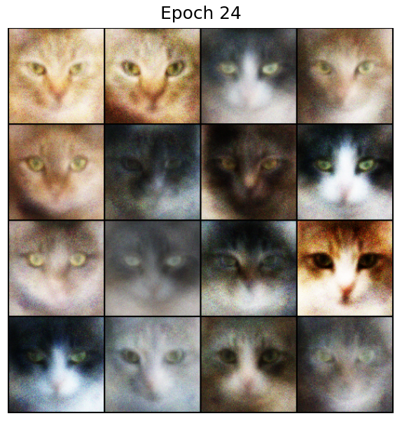

# GANs 
Generative Adversarial Network Implementing

<div align="center">
    
</div>

### Table of contents

- [Installation](#installation)
- [Training](#training)

##
### Installation

Environment Setup
```bash
conda create -n gans python=3.11
conda activate gans
git clone https://github.com/k19tvan/DCC_Basic
cd GANs
pip install requirements.txt
```

Dataset Setup
```bash
python data.py
sudo apt install unzip
unzip -o train.zip Cats_faces_64_x_64.zip
```

##
### Training
Training with Default Hyperparameters
```python
python train.py 
```

Training with Custom Hyperparameters
```python
Example: python train.py --batch_size 100 --num_epochs 20 --image_size 128 ...
```
